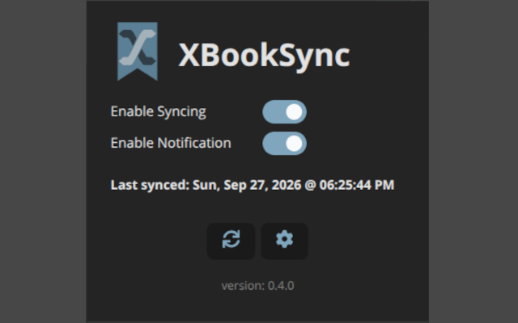
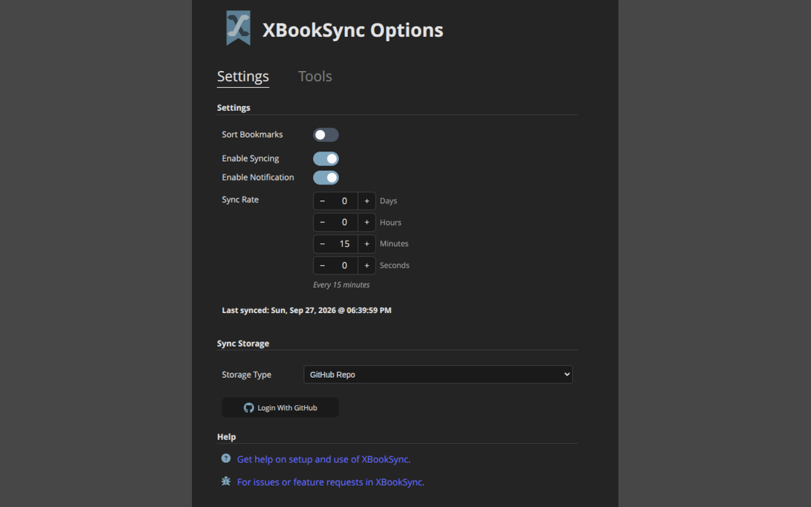
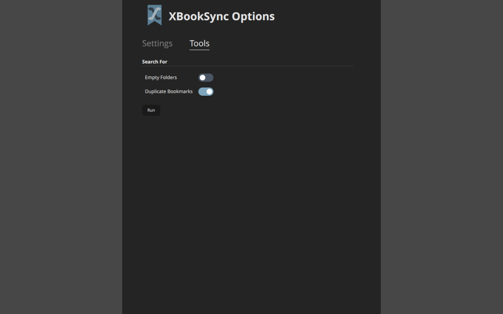

# XBookSync

A browser extension that keeps your bookmarks in sync across Chrome and Firefox by
writing them to a storage target you control — starting with a GitHub repository —
instead of a vendor account.

> **Status: early development.** The sync engine works end to end against a **GitHub
> repo**: it reads the browser's bookmark tree, three-way merges it against the target,
> and writes the result back on a schedule. The other targets in the picker (Gist, GitLab
> repo, S3) render a "not implemented yet" panel, and sync results are not yet surfaced
> in the UI.

## Why

Chrome sync and Firefox Sync each keep bookmarks inside their own account silo, and
neither talks to the other. XBookSync treats the bookmark tree as a plain document that
gets serialized to a target of your choosing, so the same bookmarks can be shared
between browsers, versioned in Git, or backed up like any other file.

## Features

| Capability          | Notes                                                                                        |
| ------------------- | -------------------------------------------------------------------------------------------- |
| **Storage targets** | GitHub repo (working) · GitHub Gist · GitLab repo · S3 (all planned)                         |
| **Three-way merge** | Local and remote edits are diffed against the last-synced base, so both sides survive a pass |
| **Scheduled sync**  | Configurable interval via the `alarms` API, with the last sync time surfaced in the popup    |
| **Manual sync**     | Sync-now button in the popup                                                                 |
| **GitHub App auth** | OAuth device flow — no client secret, no redirect URI                                        |
| **Failure signals** | A toolbar badge on a failed sync, plus a desktop notification on Chrome when unpinned        |
| **Cleanup tools**   | Find and delete empty folders and duplicate bookmarks from the options page's Tools tab      |
| **Sorting**         | Optional A–Z / Z–A sort, folders first or mixed, re-applied at the end of every sync          |
| **Cross-browser**   | Built with [WXT](https://wxt.dev), targeting Chrome MV3 and Firefox MV2 from one source tree |

The popup: sync and notification toggles, the last sync time, and the sync-now and
options buttons.



## Requirements

- [Bun](https://bun.sh) (the repo ships a `bun.lock`; npm or pnpm work too if you'd
  rather regenerate the lockfile)
- Chrome/Chromium or Firefox for development
- A GitHub account, to authorize the XBookSync GitHub App and install it on the
  repository you want to sync to — see [docs/github-setup.md](docs/github-setup.md)

## Getting started

```sh
bun install        # runs `wxt prepare` via postinstall, generating .wxt/
bun run dev        # launches Chrome with the extension loaded and HMR enabled
bun run dev:firefox
```

`wxt dev` opens a temporary browser profile with the extension already installed, so
there's no manual "load unpacked" step during development.

### Connecting a repository

1. Create a private repo for the bookmarks, and install the [XBookSync GitHub
   App](https://github.com/apps/xbooksync/installations/new) on the account that owns it,
   granting it access to that repo. This is what decides which repos the extension can
   see.
2. Open the extension's options page.
3. Under **Storage Type**, leave _GitHub Repo_ selected and click **Login**. This starts
   the device flow: a code to paste on github.com.
4. Pick the repo from the dropdown. Sync begins on the next tick.



> **Export your bookmarks first.** In every browser you connect, before installing:
> `chrome://bookmarks` → the manager's **⋮** → _Export bookmarks_, or in Firefox
> `Ctrl+Shift+O` → _Import and Backup_ → _Backup…_. A pass writes to the real bookmark
> tree and resolves conflicts in the repository's favour, and the repo's history holds
> only what it was already given — never the tree you had before connecting. See
> [Before you start](docs/github-setup.md#before-you-start-export-your-bookmarks).

> **Turn off the browser's own bookmark sync first.** On every browser running XBookSync,
> disable _Bookmarks_ in Chrome Sync (`chrome://settings/syncSetup` → _Manage what you
> sync_) and in Firefox Sync (_Settings_ → _Sync_). Running both on the same bookmarks
> duplicates them: each sync delivers a bookmark the other has already delivered, and
> neither can recognize the other's copy as the same one. Every pass then multiplies the
> copies. If duplicates have already appeared, turn the browser sync off before deleting
> them, or it will bring them back. The [Duplicate Bookmarks tool](#cleanup-tools) finds
> them for you. See
> [Turn off the browser's own bookmark sync](docs/github-setup.md#then-turn-off-the-browsers-own-bookmark-sync).

[**docs/github-setup.md**](docs/github-setup.md) walks all of this in detail — creating
the account and the private repo, installing the app, choosing which repos it can reach,
changing that list later, connecting a second browser, and troubleshooting.

### Building

```sh
bun run build          # -> .output/chrome-mv3/
bun run build:firefox  # -> .output/firefox-mv2/
bun run zip            # packaged artifact for the Chrome Web Store
bun run zip:firefox    # packaged artifact for addons.mozilla.org
bun run clean          # wxt clean: removes .output/ and other generated build artifacts
```

To load a production build by hand: `chrome://extensions` → enable _Developer mode_ →
_Load unpacked_ → pick `.output/chrome-mv3/`. On Firefox, use `about:debugging` →
_This Firefox_ → _Load Temporary Add-on_ and pick the `manifest.json` inside
`.output/firefox-mv2/`.

### Checks

```sh
bun run compile   # tsc --noEmit
bun run lint      # eslint .
bun run test      # vitest run
```

CI runs all four (compile, lint, test, both builds) on pull requests and on `main`.

## Project layout

```
entrypoints/
  background.ts            # MV3 service worker: the sync loop, alarms, message handling
  bookmarks/
    bookmarks.ts           # the Bookmarks tree: read from / write to browser.bookmarks
    sync.ts                # flatten, diffBase, applyRemote — the merge primitives
    sort.ts                # sortIfEnabled: re-orders the browser's tree after each pass
    storage.ts             # Storage singleton; owns the active adapter
    alarm.ts               # tick alarm lifecycle
    gh-repo-adapter.ts     # StorageAdapter for a GitHub repo (the working target)
    gh-gist-adapter.ts     # StorageAdapter for a Gist (signatures only, throws)
    gh-app-auth.ts         # GitHub App device flow
    gh-utils.ts            # shared REST helpers: base64, pagination, repo discovery
    nil-adapter.ts         # no-op adapter used before the real one resolves
  shared/
    types.ts               # enums, the StorageAdapter contract, message types
    localsettings.ts       # typed wrappers around WXT's extension-local storage
    syncutils.ts           # last-synced parsing / formatting, sync-error copy
    components/            # toggle switch and the debounced duration input
  popup/
    Popup.tsx              # sync toggle, last-synced time, sync-now, options link, version
  options/
    Option.tsx             # options shell: header plus the Settings and Tools tabs
    pages/
      settings.tsx         # Settings tab: sort, sync, storage, and help cards
      tools.tsx            # Tools tab: scan toggles, Run button, result cards
    tools/
      tools.ts             # findDuplicateBookmarks, findEmptyFolders
    components/            # tabs, tool result cards, and the storage, sort, sync, GitHub,
                           # and placeholder panels
tests/                     # vitest suites, with a fake browser.bookmarks
assets/                    # bundled assets (app logo)
public/icon/               # extension icons, generated by @wxt-dev/auto-icons
wxt.config.ts              # WXT config: permissions and host permissions
```

WXT auto-imports common APIs (`browser`, `storage`, `defineBackground`, the React
hooks), which is why you'll see them used without an explicit import. The generated
declarations live in `.wxt/` and are refreshed by `wxt prepare`.

### Permissions

Declared in `wxt.config.ts`:

| Permission      | Why                                                      |
| --------------- | -------------------------------------------------------- |
| `storage`       | Persisted settings and the base snapshot                 |
| `bookmarks`     | Read and write the bookmark tree                         |
| `alarms`        | Schedule periodic syncs                                  |
| `notifications` | Report a failed sync when the icon isn't pinned (Chrome) |

Plus host permissions for `github.com` and `api.github.com`. The GitHub App device
flow needs no `identity` permission — it is plain `fetch` against github.com.

## How a sync works

Bookmark node ids are per-profile, so two browsers holding the same bookmark agree on
nothing but where it sits and what it points at. `flatten` therefore discards ids and
keys each node on its identity — position plus url or title.

Each tick compares three trees: the browser's current tree, the target's, and the
**base** — a snapshot of what both agreed on at the end of the last sync. Diffing each
side against the base is what separates "the other browser added this" from "this was
deleted here":

| Local | Remote | Outcome                                                            |
| ----- | ------ | ------------------------------------------------------------------ |
| —     | —      | Nothing written, and nothing recorded — the base stays put         |
| ✓     | —      | Push local, conditional on the revision just read                  |
| —     | ✓      | Apply the remote tree wholesale                                    |
| ✓     | ✓      | Apply the remote diff into the local tree, re-read, push the merge |

Every branch that writes ends by recording the new version token, the timestamp, and a
fresh base. Writes are conditional on the revision they were based on, so a concurrent
write from another browser is rejected rather than silently overwritten. An adapter that
throws aborts the pass with the version and base untouched, so the next tick retries
from the same state.

> The both-changed branch resolves conflicts in the remote's favour: a node edited
> locally and removed remotely is removed, and a node edited on both sides takes the
> remote title.

### Sorting

When **Sort Bookmarks** is on, every pass ends by sorting the browser's tree, whichever
branch ran — so a scheduled tick, a manual sync, and a bookmark add or edit all leave
the tree sorted. It runs after any remote changes are applied, so nothing is sorted only
to be deleted, and newly created bookmarks (which land at the end of their folder) are
moved into place.

- Both anchor folders and everything beneath them are sorted; Firefox's other root
  folders (Bookmarks Menu, Mobile Bookmarks) are left alone, as they are by sync.
- Titles compare case- and accent-insensitively, with numbers by value (`Item 2`
  before `Item 10`). An untitled bookmark sorts by its url.
- Firefox separators stay where they are; each run between them is sorted on its own.
- Only nodes out of place are moved, so an already-sorted tree costs no API calls. Each
  move is recorded as the pass's own, so its `onMoved` echo doesn't trigger another sync.

Order is not part of the diff, so sorting never reads as a change, and the file on the
target holds bookmarks in whatever order the pushing browser had them.

Sorting rides on the sync pass, so it doesn't happen while syncing is switched off.

## Cleanup tools

The options page has two tabs: **Settings** and **Tools**. On the Tools tab, pick the
scans you want and click **Run**. Every run reads the browser's current bookmark tree
again. Each scan that finds something gets its own result card. Every row in a card shows
the item's full folder path and a trash icon that deletes it.



| Scan                    | Default | Finds                                                                         |
| ----------------------- | ------- | ----------------------------------------------------------------------------- |
| **Duplicate Bookmarks** | on      | Bookmarks sharing a URL, grouped under that URL with one row per copy         |
| **Empty Folders**       | off     | Folders with no children; the trash icon removes the folder with `removeTree` |

A few things to know:

- **Duplicates are exact URL matches.** `https://a.com` and `https://a.com/` count as
  different bookmarks, and titles are ignored.
- **Empty folders are reported innermost first.** A folder that holds only empty
  folders isn't listed, only the empty folders inside it. Deleting those can leave its
  parent empty, so run the scan again until it finds nothing.
- **Results are a snapshot of the last run.** A deletion from a card updates that card,
  but edits made anywhere else only appear after the next run.
- **Deletions are real and they sync.** The tools delete through `browser.bookmarks`,
  just as the bookmark manager does. The next sync pass pushes the deletions to the
  target, and from there they reach every other connected browser.

## Settings

All settings live in extension-local storage and are defined once in
`entrypoints/shared/localsettings.ts`. Defaults are seeded on install, guarded by an
`initialized` flag so an extension update never resets settings you have since changed.

| Key                          | Type                  | Default     | Meaning                                              |
| ---------------------------- | --------------------- | ----------- | ---------------------------------------------------- |
| `local:storage`              | `StorageBackend`      | `None`      | Which storage target to sync with [^1]               |
| `local:sortBookmarks`        | `boolean`             | `false`     | Sort the browser's bookmarks after every sync        |
| `local:sortOrder`            | `SortOrder`           | `Ascending` | Sort direction, when sorting is on                   |
| `local:sortFolders`          | `SortFolders`         | `FoldersFirst` | Folders ahead of bookmarks, or interleaved        |
| `local:syncEnabled`          | `boolean`             | `true`      | Master switch for syncing                            |
| `local:notificationsEnabled` | `boolean`             | Chrome only | Show a desktop notification when a sync fails [^2]   |
| `local:syncrate`             | `number`              | `900`       | Seconds between automatic syncs                      |
| `local:syncLastError`        | `SyncErrorType\|null` | `null`      | Last sync failure: kind, message, and when           |
| `local:lastSyncDateTime`     | `string \| null`      | `null`      | ISO timestamp of the last sync that changed anything |
| `local:lastSyncValue`        | `string`              | `''`        | Opaque revision token the target last reported       |
| `local:baseBookmarks`        | `object \| null`      | `null`      | Base snapshot the next diff compares against         |

[^1]:
    A fresh profile starts on no backend at all, so it sits on the no-op adapter until
    you pick a target in the options page.

[^2]:
    Seeded `true` on Chrome and `false` on Firefox — `notifications` is a Chrome-only
    path here. The toolbar badge is shown either way.

GitHub credentials are keyed separately, since they are per-target rather than global:

| Key                 | Type     | Default | Meaning                                      |
| ------------------- | -------- | ------- | -------------------------------------------- |
| `local:ghAuthToken` | `string` | `''`    | User-to-server token; empty means signed out |
| `local:ghRepo`      | `string` | `''`    | Target repo as `owner/name`                  |
| `local:ghGist`      | `string` | `''`    | Gist id, for the unimplemented Gist backend  |

Under `import.meta.env.DEV` only, `setDefaultSettings` also seeds the GitHub keys from
`debugGitHubSettings`, so an unpacked build can sync without going through the device
flow first. A release build never writes them. **Never commit a token in that block** —
it would be bundled into every artifact `bun run zip` produces.

## Adding a storage target

Each target implements `StorageAdapter` from `entrypoints/shared/types.ts`:

```ts
type StorageAdapter = {
    readonly providerId: string
    read(knownVersion: string): Promise<ReadData>
    write(content: string, previousBlobVersion?: string): Promise<string>
    registerWatchers(callback: SyncCallback): void
    unregisterWatchers(): void
}
```

Version tokens are deliberately opaque strings — an ETag, commit SHA, MD5, or content
hash, whatever the target has. An adapter only ever compares tokens it issued itself.
`read` takes the last known version so a target that supports conditional reads can
answer "unchanged" without transferring the body; `write` takes the version the write is
based on so a concurrent update is rejected. `registerWatchers` exists because an
adapter's credentials and location are themselves settings: changing them rebuilds the
adapter.

To add a target: implement the interface in its own file under `entrypoints/bookmarks/`,
add a variant to `StorageBackend`, add a case to `getStorageBackend`, add a case to the
switch in `Storage.handleStorageChange`, and add an `<option>` plus a settings panel in
`entrypoints/options/components/storage.tsx`.

## Code style

Prettier (4-space indent, no semicolons, single quotes, 120 columns) and ESLint with
`typescript-eslint` and `eslint-plugin-react-hooks`. Unused identifiers prefixed with `_`
are allowed, which is how the not-yet-implemented adapter methods stay lint clean.

## Help & issues

- [Setup and usage](https://github.com/jepomeroy/xbooksync/blob/main/README.md)
- [Setting up GitHub as a sync target](docs/github-setup.md)
- [Bug reports and feature requests](https://github.com/jepomeroy/xbooksync/issues)
